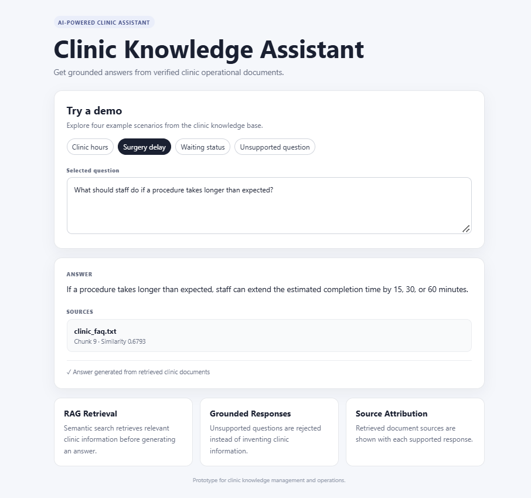
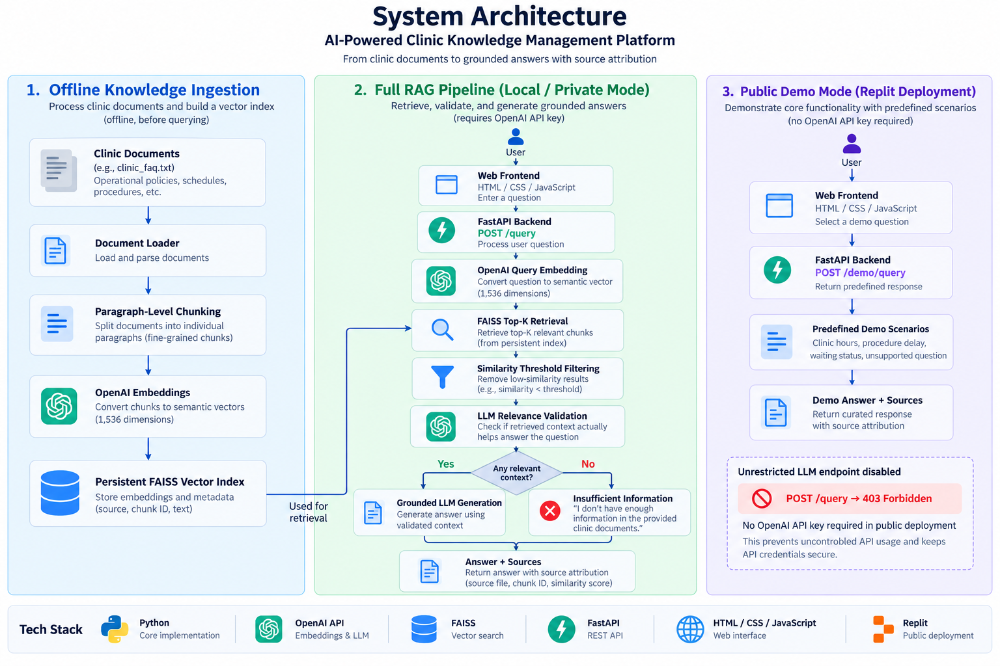

# 🏥 AI-Powered Clinic Knowledge Management Platform

A retrieval-augmented generation (RAG) system that provides **source-grounded answers from clinic operational documents**.

The system combines **OpenAI embeddings, FAISS vector retrieval, LLM-based relevance validation, FastAPI, and an interactive web interface** to improve retrieval quality, reduce unsupported responses, and provide traceable answers with source attribution.

The current version focuses on the AI knowledge-management layer of a broader clinic operations platform, with future extensions planned for real-time queue tracking, procedure status updates, and appointment management.

[🌐 Live Demo](https://intelligent-clinic-platform--belle16810.replit.app/) | [📘 API Documentation](https://intelligent-clinic-platform--belle16810.replit.app/docs)

---

## 🖥️ Web Demo



The web interface demonstrates grounded clinic-information retrieval through predefined scenarios covering clinic hours, procedure delays, waiting status, and unsupported questions.

The public deployment runs in a **restricted demo mode**. The unrestricted LLM endpoint is disabled in the public environment, allowing the application to be demonstrated without exposing an OpenAI API credential or enabling uncontrolled inference usage.

---

## ✨ Key Features

- 🔎 **Retrieval-Augmented Generation (RAG)** over clinic operational documents
- 🧠 **OpenAI embeddings** for semantic retrieval
- ⚡ **Persistent FAISS vector indexing** for similarity search
- 📄 **Paragraph-level chunking** for fine-grained retrieval
- 🎯 **Top-K semantic retrieval** with similarity filtering
- ✅ **LLM-based relevance validation** for retrieved context
- 🛡️ **Grounded generation** with unsupported-query handling
- 🔗 **Source attribution** for supported responses
- 📊 **30-query evaluation benchmark** covering direct, paraphrased, and unanswerable queries
- 🌐 **FastAPI REST API** with an interactive HTML/CSS/JavaScript interface
- 🔒 **Restricted public demo mode** with the unrestricted LLM endpoint disabled
- ☁️ **Public deployment on Replit**

---

## 🎯 Project Motivation

Clinic information can be distributed across schedules, operational policies, staff instructions, and patient-facing documents.

A standalone language model may generate plausible responses even when the required information is not available in the clinic's knowledge base. For operational use, this creates a reliability problem.

This project explores a retrieval-first architecture in which the system:

1. Retrieves relevant information from clinic documents.
2. Validates whether the retrieved context actually helps answer the question.
3. Generates an answer using only validated context.
4. Returns the supporting source information.
5. Abstains when the available documents do not contain sufficient information.

The goal is not only to generate answers, but to build a system whose retrieval behavior can be **measured, analyzed, and improved**.

---

## 🏗️ System Architecture



The application separates three major concerns:

1. **Offline knowledge ingestion**
2. **Full RAG inference**
3. **Restricted public demonstration**

### 📚 Offline Knowledge Ingestion

```text
Clinic Documents
       │
       ▼
Document Loader
       │
       ▼
Paragraph-Level Chunking
       │
       ▼
OpenAI Embeddings
       │
       ▼
Persistent FAISS Index
```

Clinic documents are processed ahead of query time. Their embeddings are generated once and stored in a persistent FAISS index together with source metadata.

### 🧠 Full RAG Mode

```text
User
 │
 ▼
Web Frontend
 │
 ▼
FastAPI /query
 │
 ▼
Query Embedding
 │
 ▼
FAISS Top-K Retrieval
 │
 ▼
Similarity Filtering
 │
 ▼
LLM Relevance Validation
 │
 ├──────── Not Relevant ────────┐
 │                              │
 ▼                              ▼
Relevant                      Abstain
 │                              │
 ▼                              │
Grounded LLM Generation         │
 │                              │
 └──────────────┬───────────────┘
                ▼
         Answer + Sources
                │
                ▼
          Web Interface
```

### 🔒 Public Demo Mode

```text
User
 │
 ▼
Web Frontend
 │
 ▼
FastAPI /demo/query
 │
 ▼
Predefined Demo Scenario
 │
 ▼
Demo Answer + Sources
```

When public demo mode is enabled:

```text
POST /demo/query  → Enabled
POST /query       → 403 Forbidden
```

The public deployment therefore does not require an OpenAI API key.

---

## 🔄 RAG Pipeline

### 📥 1. Document Ingestion

Clinic operational information is loaded from the knowledge base before being processed for retrieval.

The current prototype includes information about:

- Clinic operating hours
- Appointment scheduling
- Cancellation and rescheduling
- Procedure status
- Procedure time extensions
- Waiting queue status

The current document is intentionally limited to non-sensitive operational information.

### ✂️ 2. Paragraph-Level Chunking

The initial implementation grouped multiple paragraphs into larger chunks.

Evaluation revealed that coarse chunks could combine unrelated topics and reduce retrieval precision.

For example, procedure timing information and waiting-status information originally appeared inside the same retrieval chunk.

The pipeline was therefore changed to **paragraph-level chunking**, allowing operational statements to be represented independently.

This changed the knowledge base from:

```text
4 coarse chunks
```

to:

```text
14 paragraph-level chunks
```

and corrected a retrieval failure identified during evaluation.

### 🧠 3. Embedding Generation

Each document chunk is converted into a semantic vector using the OpenAI embedding API.

The current embedding representation contains **1,536 dimensions**.

Conceptually:

```text
Clinic Document Chunk
        │
        ▼
 OpenAI Embedding
        │
        ▼
Semantic Vector
```

Incoming user questions are embedded using the same representation so they can be compared against indexed clinic information.

### ⚡ 4. Persistent FAISS Vector Index

Document embeddings are stored in a persistent **FAISS** index.

Instead of regenerating all document embeddings for every question:

```text
Documents
   │
   ▼
Generate Embeddings Once
   │
   ▼
Persistent FAISS Index
```

At query time, only the question embedding needs to be generated before similarity search.

Metadata is stored separately so retrieved vectors can be mapped back to:

- Source document
- Chunk ID
- Original text

### 🔎 5. Top-K Semantic Retrieval

The user question is converted into an embedding and compared against the FAISS index.

```text
Question
   │
   ▼
Query Embedding
   │
   ▼
FAISS Similarity Search
   │
   ▼
Top-K Candidate Chunks
```

The current pipeline uses:

```text
Top-K = 2
```

candidate retrieval.

### 🎚️ 6. Similarity Filtering

A minimum similarity threshold is applied to remove weak retrieval candidates.

However, evaluation showed that **semantic similarity alone does not determine whether a passage actually contains enough information to answer a question**.

For example, the unsupported question:

```text
What is the clinic's phone number?
```

retrieved general clinic information with a relatively high similarity score even though the knowledge base contained no phone number.

This motivated an additional relevance-validation stage.

### ✅ 7. LLM-Based Relevance Validation

Each retrieved candidate is evaluated by an LLM relevance judge.

```text
Question
   +
Retrieved Passage
   │
   ▼
LLM Relevance Judge
   │
   ├── RELEVANT
   │
   └── NOT_RELEVANT
```

A passage is retained only when it directly contains information that helps answer the question.

This stage addresses a limitation of embedding-only retrieval:

```text
High Semantic Similarity
          ≠
Passage Contains the Answer
```

### 💬 8. Grounded Answer Generation

Only validated context is passed to the generation model.

The model is instructed to answer using the supplied clinic information rather than introducing unsupported policies or details.

If no relevant context remains after validation, the system returns:

```text
I don't have enough information in the provided clinic documents.
```

### 🔗 9. Source Attribution

Supported responses include source metadata for the retrieved clinic information.

Example:

```text
Question:
What should staff do if a procedure takes longer than expected?

Answer:
If a procedure takes longer than expected, staff can extend
the estimated completion time by 15, 30, or 60 minutes.

Source:
clinic_faq.txt
Chunk 9
```

This makes the relationship between the generated answer and the underlying knowledge base visible to the user.

---

## 🧪 Retrieval Optimization

The retrieval system was improved through an **evaluation-driven development process**.

### 🔍 Initial Retrieval Failure

The original chunking strategy produced four relatively coarse chunks.

One benchmark question asked:

```text
What number does the clinic website display?
```

The correct information was:

```text
The clinic website displays the number currently being seen.
```

However, the correct passage was not returned within the Top-2 results.

Instead, broader clinic- and website-related passages received higher retrieval rankings.

### 🛠️ Chunking Improvement

The document processing strategy was changed from grouped paragraphs to paragraph-level chunks.

After rebuilding the FAISS index, the same question retrieved:

```text
Rank 1
Similarity: 0.8341

The clinic website displays the number currently being seen.
```

Across the benchmark, Direct Recall@2 improved from:

```text
90% → 100%
```

while paraphrased-query retrieval remained at 100%.

---

## 📊 Evaluation

The system was evaluated using a **curated 30-query benchmark** derived from the clinic knowledge base.

The benchmark contains three categories:

| Category | Questions | Purpose |
|---|---:|---|
| Direct | 10 | Questions closely matching document terminology |
| Paraphrased | 10 | Equivalent questions expressed with different wording |
| Unanswerable | 10 | Questions whose answers are absent from the knowledge base |

Ground truth is based on expected document content rather than fixed chunk IDs.

This allows the chunking strategy to change without invalidating the evaluation set.

---

## 📈 Evaluation Results

### 🔎 Retrieval Performance

After introducing paragraph-level chunking:

| Metric | Result |
|---|---:|
| Direct Query Recall@2 | **100% (10/10)** |
| Paraphrased Query Recall@2 | **100% (10/10)** |

The original coarse-chunk baseline achieved:

```text
Direct Recall@2 = 90%
```

After paragraph-level chunking:

```text
Direct Recall@2 = 100%
```

### 🛡️ Unsupported-Query Rejection

Similarity filtering alone was not sufficient to reliably distinguish supported from unsupported questions.

At the evaluated similarity threshold:

| Architecture | Unsupported Query Rejection |
|---|---:|
| FAISS + similarity filtering | **20% (2/10)** |
| + LLM relevance validation | **90% (9/10)** |

Adding LLM relevance validation improved unsupported-query rejection from:

```text
20% → 90%
```

while maintaining:

```text
Direct Recall@2       = 100%
Paraphrased Recall@2  = 100%
```

### ⏱️ Latency

LLM relevance validation improves grounding but introduces additional inference latency.

Across the 30-query benchmark:

```text
Average retrieval + validation latency: 3.53 seconds
```

This creates an explicit system-design trade-off:

```text
Higher Unsupported-Query Rejection
                 ↕
Additional Validation Latency
```

Potential future optimizations include:

- Smaller relevance models
- Conditional relevance validation
- Dedicated reranking models
- Cached relevance decisions

---

## ⚠️ Known Failure Case

The relevance-validation pipeline rejected **9 of 10** unsupported questions.

The remaining failure was:

```text
Is the clinic open on weekends?
```

The knowledge base states that the clinic is open Monday through Friday but does not explicitly state that it is closed on weekends.

The relevance validator treated the weekday schedule as relevant context.

For evaluation purposes, this is considered a failure because the system prioritizes:

```text
Explicit Document Grounding
```

over:

```text
Implicit Policy Inference
```

This case demonstrates an important challenge in evaluating answerability for RAG systems.

---

## 🌐 Web Application

The RAG pipeline is exposed through a **FastAPI backend** and a lightweight web interface.

### ⚙️ API Endpoints

```text
GET   /             Web application
GET   /health       Application health and demo-mode status
POST  /query        Full RAG query endpoint
POST  /demo/query   Restricted public demonstration endpoint
```

Interactive API documentation is available through FastAPI Swagger UI:

[📘 View API Documentation](https://intelligent-clinic-platform--belle16810.replit.app/docs)

### 🎨 Frontend

The frontend is implemented with:

- HTML
- CSS
- JavaScript

The interface displays:

- Demo scenarios
- Selected question
- Answer
- Retrieved source
- Similarity metadata
- Grounding information

---

## 🔒 Secure Public Demo Mode

The application supports two execution modes.

### 🧑‍💻 Local / Private Mode

```text
DEMO_MODE=false
```

The full RAG pipeline is available:

```text
User Question
      │
      ▼
OpenAI Embedding
      │
      ▼
FAISS Retrieval
      │
      ▼
Relevance Validation
      │
      ▼
Grounded Generation
      │
      ▼
Answer + Sources
```

This mode requires an OpenAI API key.

### 🌍 Public Demo Mode

```text
DEMO_MODE=true
```

The public Replit deployment exposes four predefined scenarios:

- Clinic hours
- Procedure delay
- Waiting status
- Unsupported question

The unrestricted endpoint is disabled:

```text
POST /query
→ 403 Forbidden
```

while:

```text
POST /demo/query
→ Enabled
```

The public deployment therefore does **not require an OpenAI API key**.

This design reduces:

- API credential exposure risk
- Uncontrolled API usage
- Unexpected inference costs
- Abuse of the public LLM endpoint

The public demo remains sufficient to demonstrate the application's interface, grounded-response behavior, source attribution, and unsupported-query handling.

---

## 🖥️ Demo Scenarios

### 🕐 Clinic Hours

**Question**

```text
What are the clinic's opening hours?
```

**Answer**

```text
The clinic is open Monday through Friday from 9:00 AM to
12:00 PM and from 2:00 PM to 6:00 PM.
```

### 🏥 Procedure Delay

**Question**

```text
What should staff do if a procedure takes longer than expected?
```

**Answer**

```text
If a procedure takes longer than expected, staff can extend
the estimated completion time by 15, 30, or 60 minutes.
```

### 🔢 Waiting Status

**Question**

```text
What number does the clinic website display?
```

**Answer**

```text
The number currently being seen.
```

### 🚫 Unsupported Question

**Question**

```text
What is the clinic's phone number?
```

**Answer**

```text
I don't have enough information in the provided clinic documents.
```

This scenario demonstrates abstention when the required information is absent from the knowledge base.

---

## 🧰 Tech Stack

### 🤖 AI / LLM

- OpenAI API
- Retrieval-Augmented Generation (RAG)
- Embeddings
- LLM relevance validation

### 🔎 Retrieval

- FAISS
- Vector similarity search
- Top-K retrieval
- Similarity filtering
- Persistent vector indexing

### ⚙️ Backend

- Python
- FastAPI
- Pydantic
- REST APIs

### 🎨 Frontend

- HTML
- CSS
- JavaScript

### 📊 Evaluation

- Custom 30-query benchmark
- Recall@2
- Unsupported-query rejection
- Latency measurement
- Retrieval failure analysis

### ☁️ Deployment & Development

- Replit
- Git
- GitHub
- Conda

---

## 📁 Project Structure

```text
intelligent-clinic-platform/
│
├── app/
│   ├── api.py
│   ├── llm_test.py
│   │
│   ├── rag/
│   │   ├── loader.py
│   │   ├── chunker.py
│   │   ├── embeddings.py
│   │   ├── vector_store.py
│   │   ├── retriever.py
│   │   ├── relevance.py
│   │   └── rag.py
│   │
│   └── evaluation/
│       ├── questions.json
│       ├── evaluate_retrieval.py
│       └── evaluate_rag.py
│
├── data/
│   └── clinic_faq.txt
│
├── images/
│   ├── web_demo.png
│   └── system_architecture.png
│
├── static/
│   ├── index.html
│   ├── style.css
│   └── app.js
│
├── requirements.txt
├── .gitignore
└── README.md
```

Generated vector-store artifacts, API credentials, and local environment files are excluded from version control.

---

## 🚀 Local Setup

### 📥 1. Clone the Repository

```bash
git clone https://github.com/YOUR_USERNAME/intelligent-clinic-platform.git
cd intelligent-clinic-platform
```

Replace `YOUR_USERNAME` with the repository owner's GitHub username.

### 🐍 2. Create a Python Environment

Using Conda:

```bash
conda create -p ./env python=3.12
conda activate ./env
```

Alternatively, use another Python virtual environment.

### 📦 3. Install Dependencies

```bash
pip install -r requirements.txt
```

### 🔑 4. Configure the OpenAI API Key

Create a `.env` file in the project root:

```text
OPENAI_API_KEY=your_api_key_here
```

The `.env` file is excluded from version control through `.gitignore`.

Never commit API credentials to Git.

### 🧠 5. Build the Vector Store

```bash
python -m app.rag.vector_store
```

This process:

1. Loads the clinic knowledge document.
2. Creates paragraph-level chunks.
3. Generates embeddings.
4. Builds the FAISS index.
5. Stores vector metadata locally.

### ▶️ 6. Start the Application

```bash
python -m uvicorn app.api:app --reload
```

Open:

```text
http://127.0.0.1:8000/
```

FastAPI Swagger documentation:

```text
http://127.0.0.1:8000/docs
```

---

## 🧪 Running Evaluation

### 🔎 Retrieval Evaluation

```bash
python -m app.evaluation.evaluate_retrieval
```

This evaluates semantic retrieval behavior across the curated benchmark.

### ✅ Relevance Validation Evaluation

```bash
python -m app.evaluation.evaluate_rag
```

This evaluates:

- Direct-query retrieval
- Paraphrased-query retrieval
- Unsupported-query rejection
- Retrieval + relevance-validation latency

---

## 🔐 Running Public Demo Mode Locally

### Windows CMD / Anaconda Prompt

```cmd
set DEMO_MODE=true
python -m uvicorn app.api:app --reload
```

### PowerShell

```powershell
$env:DEMO_MODE="true"
python -m uvicorn app.api:app --reload
```

In demo mode:

```text
POST /demo/query → Enabled
POST /query      → 403 Forbidden
```

No OpenAI API key is required for the predefined demo scenarios.

---

## 🌍 Live Demo

The restricted public demo is deployed on Replit.

🌐 **Live Application**  
https://intelligent-clinic-platform--belle16810.replit.app/

📘 **FastAPI Documentation**  
https://intelligent-clinic-platform--belle16810.replit.app/docs

The public deployment operates with:

```text
DEMO_MODE=true
```

and does not expose an OpenAI API credential.

---

## 🧭 Technical Decisions

### 📄 Why Paragraph-Level Chunking?

Initial evaluation showed that larger chunks mixed unrelated clinic topics and caused retrieval failures.

Paragraph-level chunks improved retrieval granularity and increased Direct Recall@2 from:

```text
90% → 100%
```

on the curated benchmark.

### ⚡ Why FAISS?

FAISS provides efficient local vector similarity search without requiring an external managed vector database.

For the current prototype, it provides:

- Fast local retrieval
- Persistent vector indexing
- Straightforward embedding integration
- Minimal infrastructure overhead

A managed vector database could be introduced later if the system requires larger-scale document collections, distributed storage, or production metadata filtering.

### ✅ Why LLM Relevance Validation?

Embedding similarity measures semantic closeness but does not guarantee that a retrieved passage contains enough information to answer the question.

Evaluation showed that unsupported questions could still receive high similarity scores.

The relevance-validation layer improved unsupported-query rejection from:

```text
20% → 90%
```

while preserving retrieval recall on the direct and paraphrased benchmark queries.

### 🔒 Why Restricted Public Demo Mode?

The complete application uses external LLM APIs.

An unrestricted public inference endpoint could allow anonymous users to consume API credits or abuse the service.

The public deployment therefore:

- Uses predefined scenarios
- Disables unrestricted `/query` requests
- Does not require an OpenAI API credential
- Preserves the complete RAG implementation for local/private execution

This separates **technical demonstration** from **unrestricted public inference access**.

---

## 🗺️ Future Work

The current version focuses on the **AI knowledge-management layer**.

Planned extensions include:

- 📅 Online appointment scheduling
- 🔢 Real-time consultation queue tracking
- 🏥 Procedure status updates
- ⏱️ Procedure ETA extensions for clinic staff
- 👩‍⚕️ Staff operations dashboard
- 🔐 Authentication and role-based access control
- 📚 Multi-document clinic knowledge ingestion
- 🔄 Automatic vector-index updates when documents change
- 🧠 Retrieval reranking
- ⚡ Lower-latency relevance validation
- ☁️ Production-ready managed vector storage
- 📊 Expanded retrieval and generation evaluation

These components would extend the project from a clinic knowledge assistant into a broader **AI-powered clinic operations platform**.

---

## 📌 Project Status

```text
RAG Core                         ✅
Document Ingestion               ✅
Paragraph-Level Chunking         ✅
OpenAI Embeddings                ✅
Persistent FAISS Index           ✅
Top-K Retrieval                  ✅
Similarity Filtering             ✅
LLM Relevance Validation         ✅
Grounded Generation              ✅
Source Attribution               ✅
30-Query Evaluation              ✅
FastAPI Backend                  ✅
Interactive Web Interface        ✅
Restricted Public Demo Mode      ✅
Public Replit Deployment         ✅
Clinic Operations Features       🚧
```

---

## 📚 What I Learned

This project provided hands-on experience with practical RAG and AI application engineering challenges:

- Retrieval quality depends heavily on document chunking strategy.
- High embedding similarity does not guarantee answerability.
- Evaluation should include both answerable and unanswerable queries.
- Retrieval changes should be validated quantitatively rather than selected only through manual testing.
- LLM-based relevance validation can improve grounding while introducing additional latency.
- Source attribution improves response traceability.
- Public LLM applications require explicit credential, cost, and endpoint-abuse controls.
- Separating ingestion, retrieval, validation, generation, API, and presentation layers makes the system easier to evaluate and extend.

---

## 👤 Author

**Belle Dai**  
M.S. Computer Science, University of Southern California

Built as an independent project exploring practical **LLM, RAG, retrieval evaluation, and AI application engineering**.