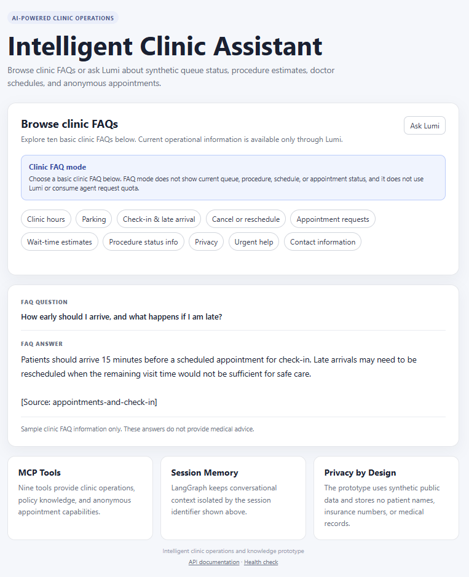
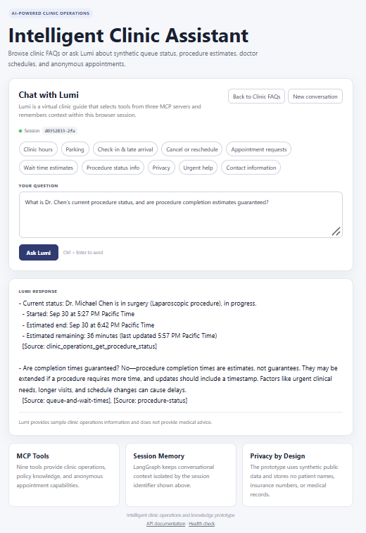
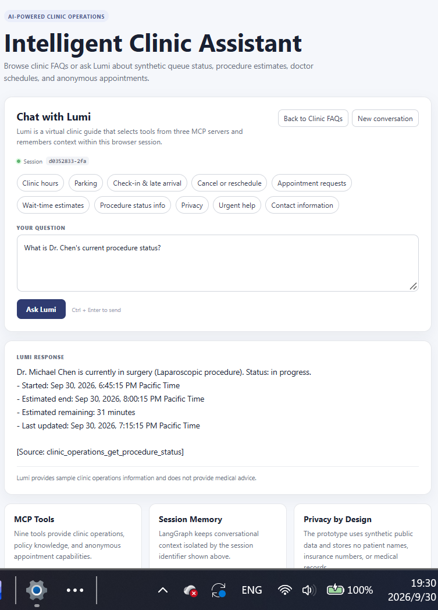
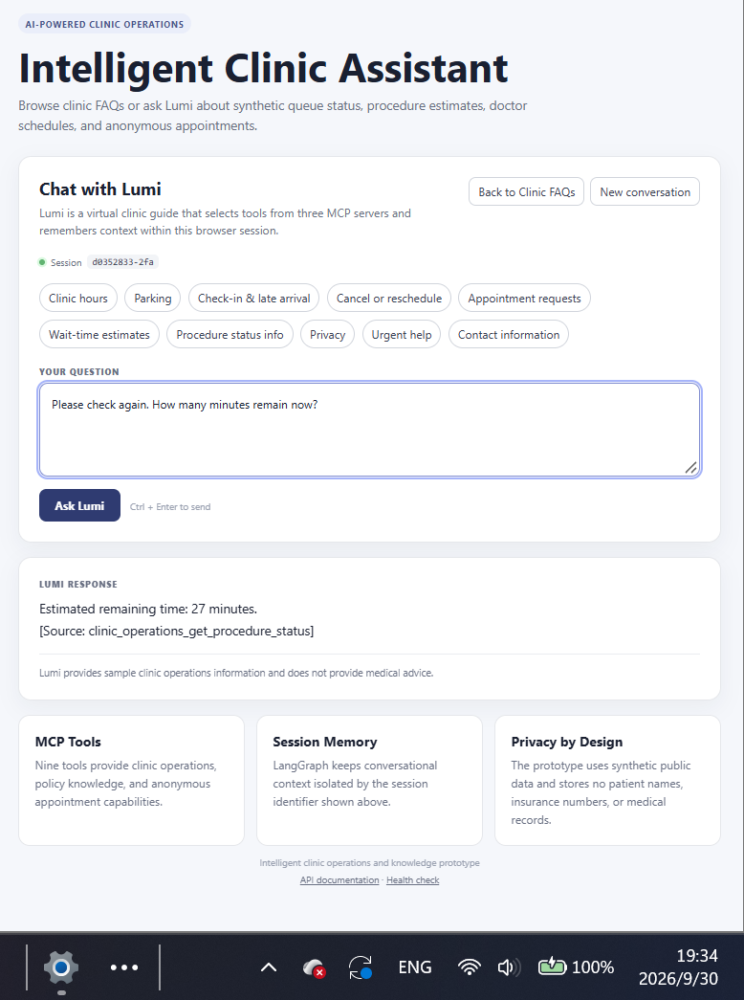
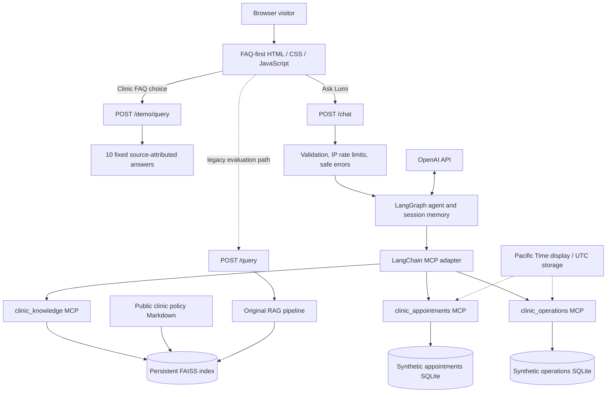

# 🏥 Intelligent Clinic Assistant

A portfolio-ready clinic operations and knowledge assistant built with
**FastAPI, LangGraph, Model Context Protocol (MCP), OpenAI, FAISS, SQLite, and
JavaScript**.

The browser opens in a no-cost **Clinic FAQ mode**. Visitors can optionally
switch to **Lumi**, a virtual clinic guide that uses a LangGraph agent to select
from nine tools exposed by three MCP servers. Lumi can answer source-grounded
policy questions, read synthetic queue and procedure status, check doctor
schedules, and reserve anonymous synthetic appointment slots while retaining
context within the browser session.

> All doctors, queues, procedures, appointments, contact details, and
> timestamps in this project are synthetic. The application is not connected
> to a real clinic and does not provide medical advice.

---

## ✨ Highlights

- 📚 FAQ-first interface with ten fixed, source-attributed clinic answers
- 💡 Lumi virtual clinic guide with free-form, multi-turn conversation
- 🧠 LangGraph agent with session-scoped memory and multi-tool chaining
- ⚡ Persistent per-instance MCP connections and a reusable compiled agent graph
- 🔌 Three MCP servers exposing nine typed tools
- 🔎 OpenAI-powered semantic retrieval over a persistent FAISS index
- 🗄️ Synthetic queue, procedure, schedule, and appointment data in SQLite
- 🕒 Pacific Time presentation with UTC timestamp storage
- 📅 Anonymous appointment reservations without patient or insurance data
- 🛡️ Input validation, IP rate limiting, safe errors, and a public chat switch
- 📊 Original RAG pipeline and 30-query retrieval evaluation retained
- 🐳 Multi-stage, non-root Docker image
- ✅ 62 automated tests covering the API, MCP integration, retrieval, memory,
  validation, rate limits, failure handling, and container files

---

## 🖥️ Web Experience

### 📚 Clinic FAQ mode



FAQ mode is the default landing page. It provides ten predefined questions
covering clinic hours, parking, check-in and late arrival, cancellations,
appointment requests, wait-time estimates, procedure-status labels, privacy,
urgent help, and sample contact information.

FAQ answers are returned through `POST /demo/query`. They do not call OpenAI
and do not consume Lumi's request quota. Current queue, procedure, schedule,
and appointment availability are intentionally excluded from this mode.

### 💡 Ask Lumi



When `PUBLIC_CHAT_ENABLED=true`, the **Ask Lumi** button opens the free-form
agent interface. Lumi sends questions to `POST /chat`, discovers the MCP tools,
selects the appropriate tool or tools, and cites the supporting policy document
or operational tool in the response.

The example above combines live synthetic procedure status from
`clinic_operations_get_procedure_status` with wait-time policy retrieved from
`queue-and-wait-times`.

### 🧠 Dynamic status and session memory

<p align="center">
  
  
</p>

The follow-up asks only to check again. Lumi retains the doctor and procedure
context under the same browser session ID, calls the tool again, and returns a
new remaining-time estimate. Public timestamps are displayed in Pacific Time.

---

## 🏗️ System Architecture


```mermaid
flowchart TB
    Visitor[Browser visitor] --> UI[FAQ-first HTML / CSS / JavaScript]

    UI -->|Clinic FAQ choice| Demo[POST /demo/query]
    Demo --> FAQ[10 fixed source-attributed answers]

    UI -->|Ask Lumi| Chat[POST /chat]
    Chat --> Guard[Validation, IP rate limits, safe errors]
    Guard --> Agent[LangGraph agent and session memory]
    OpenAI[OpenAI API] <--> Agent
    Agent --> Adapter[LangChain MCP adapter]

    Adapter --> Ops[clinic_operations MCP]
    Adapter --> Knowledge[clinic_knowledge MCP]
    Adapter --> Appointments[clinic_appointments MCP]

    Ops --> OpsDB[(Synthetic operations SQLite)]
    Knowledge --> FAISS[(Persistent FAISS index)]
    Policies[Public clinic policy Markdown] --> FAISS
    Appointments --> ApptDB[(Synthetic appointments SQLite)]

    UI -. legacy evaluation path .-> Query[POST /query]
    Query --> RAG[Original RAG pipeline]
    RAG --> FAISS

    Clock[Pacific Time display / UTC storage] -.-> Ops
    Clock -.-> Appointments
```

The application has three main request paths:

1. 📚 `POST /demo/query` returns a selected fixed FAQ answer without using an LLM.
2. 💡 `POST /chat` runs Lumi through LangGraph, OpenAI, and the MCP tool layer.
3. 🔎 `POST /query` preserves the original FAISS RAG pipeline for evaluation and
   backward compatibility; it is not the default browser experience.

FastAPI initializes the three MCP connections and compiles the LangGraph agent
once during the application lifespan. Later Lumi turns reuse that warm runtime
instead of starting and rediscovering all three MCP servers for every request.
Agent turns are serialized within an instance so connected stdio MCP sessions
cannot mix request context.

---

## 🔌 MCP Servers and Tools

The agent reads `mcp_config.json`, starts each local server with the active
Python interpreter, and discovers the tools through the MCP protocol.

| MCP server | Tool | Purpose |
|---|---|---|
| `clinic_operations` | `list_doctors` | List the synthetic doctors and their IDs |
| `clinic_operations` | `get_queue_status` | Return a doctor's queue and optionally estimate a ticket's wait |
| `clinic_operations` | `get_procedure_status` | Return procedure status, calculated remaining time, and the estimate disclaimer |
| `clinic_operations` | `get_doctor_schedule` | Return a recurring schedule, optionally filtered by weekday |
| `clinic_knowledge` | `list_knowledge_documents` | List the available public policy documents |
| `clinic_knowledge` | `search_clinic_knowledge` | Search policy passages using configured semantic FAISS or lexical retrieval |
| `clinic_knowledge` | `read_knowledge_document` | Read one complete policy document by ID |
| `clinic_appointments` | `list_available_appointments` | List synthetic slots by doctor and/or date |
| `clinic_appointments` | `book_appointment` | Reserve a slot and return an anonymous booking reference |

The system prompt requires clinic-specific claims to come from tool results.
The API appends citations from successful tools used in the current turn and
document IDs returned by knowledge tools. When the available data is
insufficient, Lumi is instructed to say so rather than invent a policy or
status.

Operational data is synthetic SQLite seed data. Dr. Lee initially serves ticket
18, has issued tickets through 24, and averages 12 minutes per visit. For an
unissued ticket such as 28, the tool labels the 120-minute calculation as a
hypothetical projection, not an actual queue position or wait estimate. Dr.
Chen's sample procedure is initially set to start 30 minutes before the
database is seeded and to end 45 minutes afterward. After that estimated end
passes, the next database read resets its sample start/end to 30 minutes before
and 45 minutes after that read.
Queue timestamps refresh on reads, but queue numbers do not automatically
advance. These timestamps and estimates demonstrate changing data; they are
not connected to a real clinic or live staff updates.

---

## 🔎 Knowledge and Retrieval

Public clinic policies are stored as Markdown files in `clinic_knowledge/`:

- 📅 Appointments and check-in
- 🕘 Clinic hours
- ☎️ Contact information
- 🅿️ Directions and parking
- 🏥 Procedure status
- ⏳ Queues and wait times
- 🚨 Urgent care and emergencies

`search_clinic_knowledge` splits these files into paragraphs, creates OpenAI
embeddings, normalizes the vectors, and stores them in a persistent FAISS
inner-product index. A content-and-model fingerprint is stored beside the
index, so it is reused while current and rebuilt when the source documents or
embedding model change.

Set `CLINIC_KNOWLEDGE_SEARCH_MODE=lexical` to use the key-free lexical search
implementation instead of semantic embeddings.

### 🧬 Original RAG pipeline

The original pipeline under `app/rag/` remains part of the project:

```text
Document loading → paragraph chunking → OpenAI embeddings → FAISS
→ Top-K retrieval → similarity filtering → LLM relevance validation
→ grounded answer with source metadata
```

The included 30-question benchmark contains 10 direct, 10 paraphrased, and 10
unanswerable questions. The recorded evaluation after switching from coarse to
paragraph-level chunks was:

| Metric | Recorded result |
|---|---:|
| Direct Recall@2 | 100% (10/10) |
| Paraphrased Recall@2 | 100% (10/10) |
| Unsupported-query rejection with similarity only | 20% (2/10) |
| Unsupported-query rejection with LLM validation | 90% (9/10) |
| Average retrieval and validation latency | 3.53 seconds |

These benchmark figures describe the original RAG evaluation dataset, not the
fixed FAQ endpoint or the synthetic MCP operations data.

---

## 🌐 API

Interactive OpenAPI documentation is available locally at
`http://127.0.0.1:8080/docs` after the application starts.

| Method and path | Purpose |
|---|---|
| `GET /` | Serve the browser interface |
| `GET /health` | Report service, agent, MCP-server count, and public-chat status |
| `POST /demo/query` | Return one predefined Clinic FAQ answer |
| `POST /chat` | Run one session-scoped Lumi turn |
| `POST /query` | Run the original FAISS RAG pipeline |

Example Lumi request:

```json
{
  "query": "What is Dr. Chen's current procedure status?",
  "session_id": "browser-generated-session-id"
}
```

Example response:

```json
{
  "response": "...source-grounded Lumi response..."
}
```

---

## 🛡️ Safety, Privacy, and Cost Controls

- ✍️ Chat questions are stripped and limited to 1,000 characters.
- 🪪 Session IDs are stripped and limited to 128 characters.
- 🚦 Each client IP is limited to 3 `/chat` requests per minute and 10 per UTC
  day by default.
- ⏱️ Rate-limit responses use HTTP 429 with `Retry-After` and
  `X-Rate-Limit-Reason` headers.
- ↩️ When a limit is reached, the UI offers a user-controlled return to the
  no-cost Clinic FAQ mode; it does not silently replace an agent answer.
- 🔒 `PUBLIC_CHAT_ENABLED=false` disables `/chat` with HTTP 403 and hides the
  **Ask Lumi** control without rebuilding the application.
- 🧯 Expected model, configuration, and MCP failures return controlled 502/503
  responses without exposing internal exception details.
- ⚠️ Unexpected errors return a generic HTTP 500 response.
- 🕶️ The synthetic public interface stores no patient names, diagnoses, medical
  record numbers, insurance numbers, or government health-card data.
- 💳 Provider-side spending limits should remain the final billing safeguard.

The rate limiter and LangGraph memory are intentionally in-process for this
single-instance portfolio application. Their state resets on restart and is
not shared across multiple workers. A production deployment should use a
shared store such as Redis or an API gateway.

---

## 🕒 Time and Synthetic Data

- 🌎 `America/Los_Angeles` is the default clinic timezone.
- 🌤️ Public timestamps and appointments automatically follow PST/PDT transitions.
- 🕒 Operational timestamp values are stored in UTC and converted at the MCP
  boundary.
- 🔄 Queue and procedure records are synthetic. With
  `CLINIC_REFRESH_DEMO_DATA=true`, expired demo timestamps are refreshed so the
  current-status examples remain useful.
- 📆 Appointment reservations are synthetic and anonymous. Booking consumes the
  selected demo slot and returns a generated reference such as `APT-XXXXXXXX`.

---

## 🧰 Technology Stack

- 🐍 **Backend:** Python, FastAPI, Pydantic, Uvicorn
- 🧠 **Agent:** LangGraph, LangChain MCP adapter, OpenAI API
- 🔎 **Retrieval:** OpenAI embeddings, FAISS, NumPy
- 🔌 **Protocol:** Model Context Protocol (MCP)
- 🗄️ **Storage:** SQLite, Markdown policy documents, persistent FAISS indexes
- 🎨 **Frontend:** HTML, CSS, JavaScript
- ✅ **Testing:** Pytest, FastAPI TestClient
- 🐳 **Deployment:** Docker, Linux-compatible non-root runtime

---

## 📁 Project Structure

```text
intelligent-clinic-platform/
├── app/
│   ├── api.py                       # FastAPI routes and fixed FAQ data
│   ├── models.py                    # Validated chat request/response models
│   ├── rate_limit.py                # In-memory IP rate limiter
│   ├── services/
│   │   └── chat.py                  # LangGraph, OpenAI, MCP, and memory
│   ├── rag/                         # Original RAG pipeline
│   │   ├── chunker.py
│   │   ├── embeddings.py
│   │   ├── loader.py
│   │   ├── rag.py
│   │   ├── relevance.py
│   │   ├── retriever.py
│   │   └── vector_store.py
│   └── evaluation/
│       ├── questions.json
│       ├── evaluate_rag.py
│       └── evaluate_retrieval.py
├── mcp_servers/
│   ├── clinic_operations/
│   │   ├── database.py
│   │   └── server.py
│   ├── clinic_knowledge/
│   │   └── server.py
│   ├── clinic_appointments/
│   │   ├── database.py
│   │   └── server.py
│   └── clinic_time.py
├── clinic_knowledge/                # Seven public policy documents
├── data/
│   └── clinic_faq.txt               # Original RAG evaluation corpus
├── static/
│   ├── index.html
│   ├── style.css
│   └── app.js
├── tests/                           # 62 automated tests
├── images/                          # README screenshots
├── .dockerignore
├── .env.example
├── .gitignore
├── Dockerfile
├── main.py                          # Port 8080 application entry point
├── mcp_config.json                  # Three local MCP server definitions
├── requirements.txt
└── README.md
```

Generated SQLite databases, FAISS indexes, credentials, virtual environments,
and local cache files are excluded from version control.

---

## 🚀 Local Setup

### 🐍 1. Create and activate the environment

From Anaconda Prompt on Windows:

```cmd
conda create -p ./env python=3.12
conda activate ./env
```

### 📦 2. Install dependencies

```cmd
python -m pip install -r requirements.txt
```

### 🔑 3. Configure the application

Copy `.env.example` to `.env`, then set at least:

```text
OPENAI_API_KEY=your_key_here
OPENAI_MODEL=gpt-5-nano
OPENAI_REASONING_EFFORT=minimal
OPENAI_EMBEDDING_MODEL=text-embedding-3-small
```

Never commit `.env` or an API key.

### ▶️ 4. Start the application

```cmd
python main.py
```

Open:

- 🌐 Application: `http://127.0.0.1:8080`
- 📘 API documentation: `http://127.0.0.1:8080/docs`
- 💚 Health check: `http://127.0.0.1:8080/health`

The terminal displays `http://0.0.0.0:8080` because the server listens on all
local interfaces. `0.0.0.0` is a bind address; use `127.0.0.1` or `localhost`
in the browser.

`APP_RELOAD=true` is the local default. Set it to `false` when automatic reload
is not wanted.

---

## ⚙️ Configuration

| Variable | Default | Purpose |
|---|---|---|
| `OPENAI_API_KEY` | none | Required for Lumi and semantic embedding calls |
| `OPENAI_MODEL` | `gpt-5-nano` | Lumi chat model |
| `OPENAI_REASONING_EFFORT` | `minimal` | Reduce reasoning-token cost and latency for focused tool calls |
| `OPENAI_EMBEDDING_MODEL` | `text-embedding-3-small` | Semantic index model |
| `OPENAI_BASE_URL` | empty | Optional compatible API base URL |
| `PUBLIC_CHAT_ENABLED` | `true` | Show and enable Lumi chat |
| `CHAT_RATE_LIMIT_PER_MINUTE` | `3` | Per-IP rolling-minute chat limit |
| `CHAT_RATE_LIMIT_PER_DAY` | `10` | Per-IP UTC-day chat limit |
| `MCP_SERVERS_CONFIG` | `mcp_config.json` | MCP server configuration path |
| `CLINIC_DB_PATH` | `data/clinic_operations.db` | Operations SQLite path |
| `CLINIC_REFRESH_DEMO_DATA` | `true` | Refresh expired synthetic procedure times |
| `CLINIC_TIMEZONE` | `America/Los_Angeles` | Public clinic timezone |
| `CLINIC_APPOINTMENTS_DB_PATH` | `data/clinic_appointments.db` | Appointment SQLite path |
| `CLINIC_KNOWLEDGE_DIR` | `clinic_knowledge` | Policy document directory |
| `CLINIC_KNOWLEDGE_INDEX_DIR` | `data` | Persistent knowledge-index directory |
| `CLINIC_KNOWLEDGE_SEARCH_MODE` | `semantic` | `semantic` or key-free `lexical` search |
| `DEMO_MODE` | `false` | Disable only the legacy `/query` endpoint |
| `APP_RELOAD` | `true` locally | Enable Uvicorn reload in `main.py` |
| `PORT` | `8080` | HTTP port |

### 🔒 FAQ-only mode

To expose only the fixed FAQ interface without Lumi/OpenAI chat:

```cmd
set PUBLIC_CHAT_ENABLED=false
python main.py
```

`POST /demo/query` remains available and `POST /chat` returns HTTP 403.

---

## 🐳 Docker

Build the image:

```bash
docker build -t intelligent-clinic-assistant .
```

Run it with environment configuration:

```bash
docker run --rm -p 8080:8080 --env-file .env intelligent-clinic-assistant
```

The Dockerfile uses separate builder and runtime stages, runs as a non-root
user, disables application reload, and exposes port 8080.

### ☁️ Cloud Run deployment settings

For this single-instance portfolio demo, deploy with scale-to-zero and at most
one instance so the in-memory request limits and session memory stay as
consistent as possible:

```bash
gcloud run deploy intelligent-clinic-assistant \
  --source . \
  --region us-west1 \
  --allow-unauthenticated \
  --min-instances 0 \
  --max-instances 1 \
  --concurrency 1 \
  --set-secrets OPENAI_API_KEY=YOUR_SECRET_NAME:latest \
  --set-env-vars PUBLIC_CHAT_ENABLED=true,CHAT_RATE_LIMIT_PER_MINUTE=3,CHAT_RATE_LIMIT_PER_DAY=10,APP_RELOAD=false
```

Create the secret in Google Secret Manager first and replace `YOUR_SECRET_NAME`
with its name. Never put the API key itself in the command or commit it to Git.
Cloud Run's local filesystem is ephemeral: generated SQLite data and FAISS
indexes are recreated after an instance stops. This is suitable for the
synthetic portfolio demo, but reservations and conversation history do not
persist across restarts.

---

## ✅ Tests

Run the full suite from the activated environment. Restrict collection to
`tests/` so local temporary folders are not scanned, and disable pytest's
optional cache if the workspace does not permit writing `.pytest_cache`:

```cmd
python -m pytest tests -q -p no:cacheprovider --basetemp=.pytest-tmp-local
```

`--basetemp` keeps test-created temporary data inside the project.

Current verified result:

```text
62 passed
```

The suite tests:

- 🌐 FastAPI routes and frontend contracts
- ✍️ Request and session validation
- 📚 FAQ-only and public-chat behavior
- 🚦 Per-minute and daily rate limits
- 🧯 Safe model, MCP, and unexpected-error responses
- 🔌 MCP discovery and multi-tool agent execution
- 🧠 Session memory and session isolation
- 🧩 All three MCP servers and their typed schemas
- 🔎 Semantic FAISS retrieval and document attribution
- 🕒 Synthetic data refresh and Pacific Time conversion
- 🐳 Docker and `.dockerignore` safety requirements

The LangChain MCP adapter currently emits a beta API warning during tests; this
does not cause a test failure.

---

## 📊 Evaluation Commands

The original RAG evaluation requires an OpenAI API key and a built vector
store:

```cmd
python -m app.rag.vector_store
python -m app.evaluation.evaluate_retrieval
python -m app.evaluation.evaluate_rag
```

---

## 🏥 Current Scope and Production Considerations

This repository is a working portfolio prototype, not a production medical
system. A production deployment would additionally require:

- 🔐 Authenticated clinic integrations instead of synthetic SQLite data
- 🧾 Authorization and audit logging
- 🔒 Encrypted persistent storage and formal data-retention rules
- 🌐 A distributed rate limiter and shared conversation store
- 📅 Appointment cancellation and identity-verification workflows
- 📈 Monitoring, alerting, and model/tool quality evaluation
- ⚖️ Clinical, privacy, legal, and security review

---

## 👤 Author

**Belle Dai**  
M.S. Computer Science, University of Southern California

Built as an independent project exploring practical **LLM agents, RAG,
LangGraph, MCP, retrieval evaluation, API safety, and AI application
engineering**.
